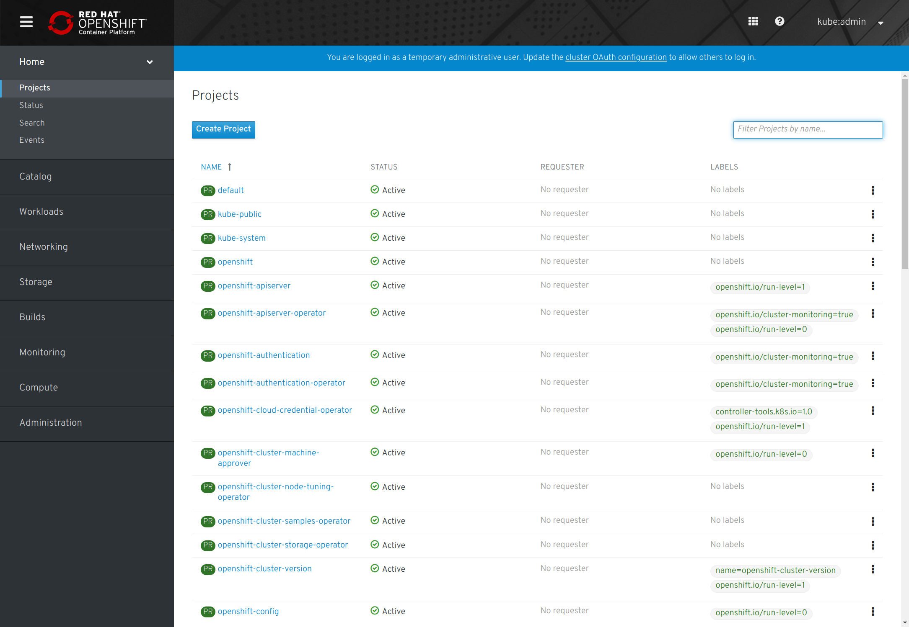

# Lab 2: Explore the OpenShift Web Console UI


## Intro

The OpenShift Container Platform web UI provide convenient access for administering and monitoring your cluster.

## Connecting a remote host

A simple method for physically connecting a remote host to the cluster is to add an open ethernet interface on the host to the _baremetal_ bridge created by libvirt. A system connected to this interface will then have access to the same DHCP and DNS services that are serving the virtual machines.

For the Chimera lab, we are adding two interfaces to the bride.
```
brctl addif baremetal enp7s0
brctl addif baremetal enp12s0
```

On your remote host, you may need to edit the `/etc/resolv.conf` file to move the new DNS server added by DHCP to the top of the list (only the first three name servers listed are actually used).

## Lab

The console is accessible from the deployment host via:
[https://console-openshift-console.apps.ostest.test.metalkube.org](https://console-openshift-console.apps.ostest.test.metalkube.org)

The temporary admin username is **kubeadmin** and the password can be found in the `ocp/auth/kubeadmin-password` file.

```
cat ocp/auth/kubeadmin-password
```





