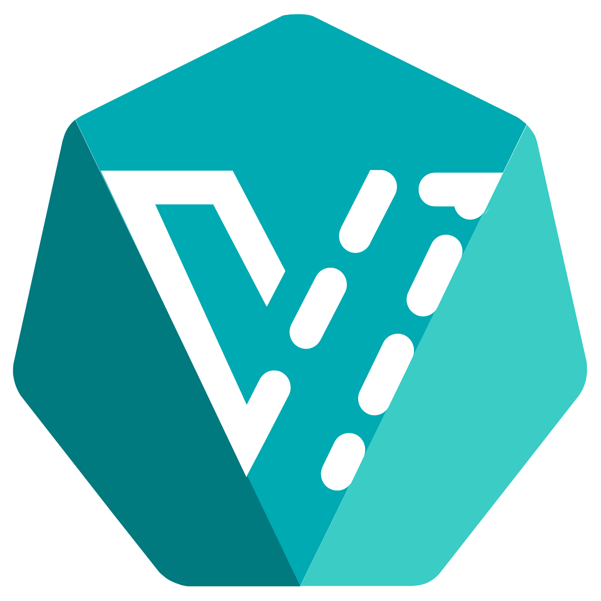

# Lab 4: Deploy kubevirt 



## Intro


## Lab

In a separate terminal, setup a watch of the pods we will create.
```
watch 'oc get pods --all-namespaces |grep  kubevirt'
```

First we create the security context constraint and then deploy the kubevirt operator.
```
oc adm policy add-scc-to-user privileged -n kubevirt -z kubevirt-operator
oc apply -f chimera-kubevirt/kubevirt-operator.yaml
```

We need a configmap in place before deploying kubevirt in order to use CDI later.
```
oc apply -f chimera-kubevirt/dv-configmap.yaml
```

Once the operator is running, we can pass the custom resource file and start the kubevirt system.
```
oc apply -f chimera-kubevirt/kubevirt-cr.yaml
```

With kubevirt up and running, we need to get the UI operator deployed as well. We'll start a new project and lay down the custom resource definition, then apply the RBAC and start the operator from the deploy directory.
```
oc new-project kubevirt-web-ui
WEBUIPATH=/root/demo/kubevirt/web-ui-operator/deploy
ls $WEBUIPATH
oc apply -f ${WEBUIPATH}/crds/kubevirt_v1alpha1_kwebui_crd.yaml
oc apply -f $WEBUIPATH
```

Once the operator is up, we'll apply the custom resource.
```
oc apply -f ${WEBUIPATH}/crds/kubevirt_v1alpha1_kwebui_cr.yaml
```

## Spin up a fedora VM

To run a fedora VM we need a PVC for it so we can provide ceph-based storage to it:
```
oc project default
oc apply -f chimera-kubevirt/fedora-pvc.yaml
oc apply -f chimera-kubevirt/fedora-vm.yaml
```

Watch the VM being spun up:
```
watch oc get vms
```

In order to create a VM from a local image, we need to deploy CDI (containerized data importer) so that we can use PVCs as disks for VMs.
CDI supports .img, .iso and .qcow2 images.

Let's watch the cdi namespace.
```
watch oc get pods -n cdi
```

Once again, we apply the operator...
```
CDIPATH=/root/demo/chimera-cdi
oc apply -f ${CDIPATH}/cdi-operator.yaml
```

And then once it is running we use the operator.
```
oc apply -f ${CDIPATH}/cdi-operator-cr.yaml
```

For our next lab, we will need a CDI data volume in place for our virtual machine instance.

Create the DataVolume for our Windows VM and import the qcow2 disk image.
```
oc apply -f chimera-cdi/win2012-dv.yaml
```

This will start a new pod to import the source into a PV. Take a look.
```
oc get pods
oc describe pod -l app=containerized-data-importer
```

This will also create a new PVC and bound PV to hold the VM disk image.
```
oc get pvc
oc get pv
```

The disk image import will take a while. When it completes, the importer pod will terminate.
```
watch oc get pods
oc get dv
oc describe dv
```

It is also interesting to watch the `ceph -s` activity during the image import.
```
watch 'oc exec -n rook-ceph $TOOLBOX -- ceph -s'
```

And if all goes well, we should have [blinkenlights](https://en.wikipedia.org/wiki/Blinkenlights).


