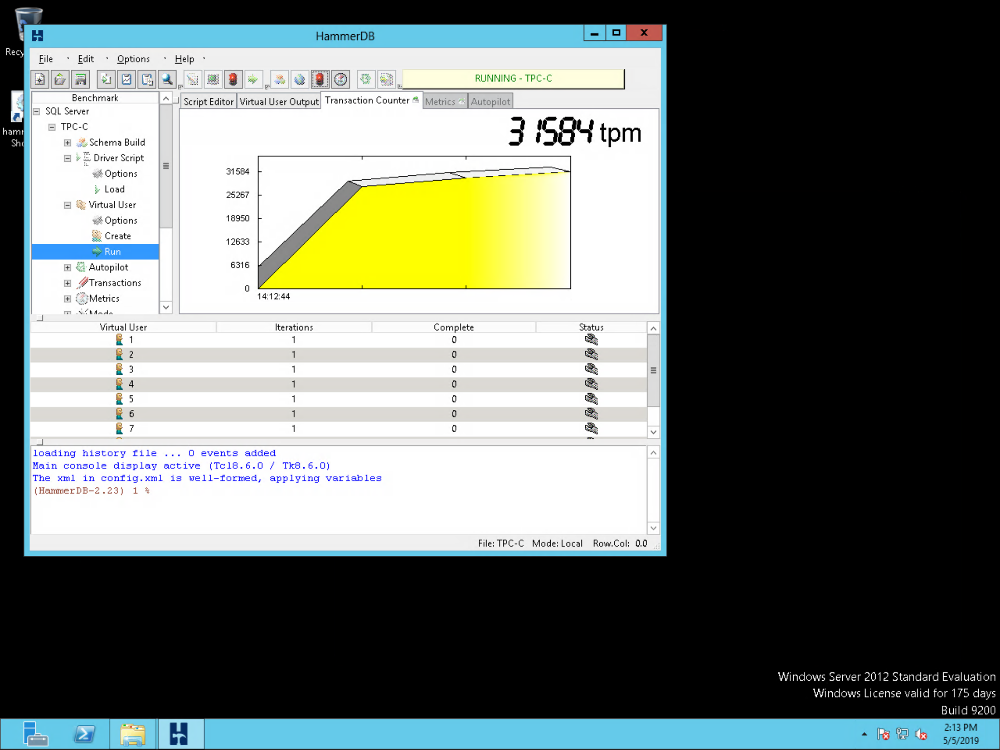

# Lab 5: VM and Container Workloads


## Create Persistent Volume Claim

In the kubevirt web console
[https://kubevirt-web-ui.apps.ostest.test.metalkube.org/](https://kubevirt-web-ui.apps.ostest.test.metalkube.org/)

Navigate to _'Storage > Persistent Volume Claims'_


Click on the _Create Persistent Volume Claim_ button. Select _rook-ceph-block_ under _Storage Class_, and use _mssql_ as your _Persistent Volume Claim Name_. For _Access Mode_ select _Single User (RWO)_ and for _Size_ input _200 Gi_, then click the _Create_ button.


## Create the MS SQL Server Pod

In the web console, navigate to _'Workloads > Pods'_.


In the _Project_ drop-down select _default_ and then click on the _Create Pod_ button. Replace the default YAML with the definition below.


```yaml
apiVersion: v1
kind: Pod
metadata:
  name: mssqlonrhel
  namespace: default
  labels:
    app: mssql
spec:
  volumes:
    - name: mssqlps
      persistentVolumeClaim:
        claimName: mssql
  containers:
    - name: sql
      image: mcr.microsoft.com/mssql/rhel/server:2019-CTP2.2
      env:
      - name: ACCEPT_EULA
        value: 'Y'
      - name: MSSQL_SA_PASSWORD
        value: WickedStrongPassw0rd
      ports:
      - containerPort: 1433
        name: sql
      volumeMounts:
        - mountPath: /var/opt/mssql/
          name: mssqlps
  imagePullSecrets:
    - name: rhsecret
```

After the pod starts, navigate to its _Terminal_ tab.


Show that this is RHEL:
```
cat /etc/redhat-release
```

Confirm our SQL Server password:
```
echo $MSSQL_SA_PASSWORD
```

Connect to the database console:
```
/opt/mssql-tools/bin/sqlcmd -S localhost -U SA -P 'WickedStrongPassw0rd'
```

What are we running on RHEL?
```
SELECT @@version
GO
```

Create a demo database:
```
CREATE DATABASE DemoDB
GO
```

Confirm our new database:
```
SELECT Name from sys.Databases
GO
```

Back on our deployment host system, let's take a look at our Ceph storage consumption
```
TOOLBOX=$(oc get pods -l app=rook-ceph-tools -n rook-ceph | grep -v NAME | awk '{print $1}')
oc exec -n rook-ceph $TOOLBOX -- ceph -s
oc exec -n rook-ceph $TOOLBOX -- ceph df
``` 

## Create the Windows Server VM

In the kubevirt web UI, navigate to _Workloads > Virtual Machines_, then click on _Create Virtual Machine_ and then _Create with Wizard_.


Name the new VM _win2012_, select _URL_ for the _Provision Source_, and input the URL:

> http://192.168.111.1:88/win2012.qcow2

Select _Microsoft Windows Server 2012 R2_ for the _Operating System_, select _Custom_ for the _Flavor_, set the _Memory_ to 4GB and the _CPUs_ to 4, and select _generic_ for the _Workload Profile_, then click the _Next_ button.


In the _Networking_ view, click on the _nic0_ and change the _BINDING METHOD_ to _bridge_, click the blue checkmark, and then click the _Next_ button.


In the _Storage_ view, click on the _rootdisk_, change the size to _65GB_ and select the _rook-ceph-block_ as the _Storage Class_. Click the blue check box, then click the _Create Virtual Machine_ button.


This will kick off an import of the data volume, which will take a few minutes. The VM cannot start until this is complete. You can see the related pods in the terminal.

```
oc get pods
oc describe pod <podname>
oc logs -f <podname>
oc get pvc
oc get dv
```

Our lab cannot support running the Windows VM on the same host as the RHEL MSSQL pod. Click on the _win2012_ virtual machine entry and then on the _YAML_ tab. Edit the `spec.template.spec` section, adding a `podAntiAffinity` rule. Click the _Save_ button when complete.

```yaml
spec:
...
  template:
  ...
    spec:
      affinity:
        podAntiAffinity:
          requiredDuringSchedulingIgnoredDuringExecution:
            - labelSelector:
                matchExpressions:
                  - key: app
                    operator: In
                    values:
                      - mssql
              topologyKey: kubernetes.io/hostname
```


Back in the _Virtual Machines_ view, click the menu button to the right of the _win2012_ virtual machine, and then click _Start Virtual Machine_.


When the _win2012_ virtual machine completes initializing and starting up, click on its _Consoles_ tab and select _Desktop Viewer_ from the drop-down list. Use the information provided to connect with the Remmina remote desktop client.

> Note: You'll likely want to adjust the client resolution rather than connecting with the defaults.


Login to Windows with the _Administrator_ username and _RedHat1!_ password. You may need to send the Ctrl-Alt-Del keystrokes.


## Run the Workload

Open the _HammerDB_ shortcut on the desktop.


Double-clik _SQL Server_ in the left pane, then click _OK_ on the two dialog boxes that pop up.


Expand the _SQL Server > TPC-C > Driver Script_ navigation on the left pane, then double-click on _Options_.


Set the values as below (leave unmentioned values at their defaults), then click _OK_.

* **SQL Server:** \<IP Address of the _mssqlonrhel_ pod\>
* **SQL Server ODBC Driver:** ODBC Driver 11 for SQL Server
* **Authentication:** SQL Server Authentication
* **SQL Server User Password:** WickedStrongPassw0rd
* **SQL Server Database:** DemoDB
* **TPC-C Driver Script:** Timed Test Driver Script
* **Minutes of Rampup Time:** 0
* **Minutes for Test Duration:** 30
* **Use All Warehouses:** _checked_


Double-click the _Load_ item under the _SQL Server > TPC-C > Driver Script_ navigation.


Expand the _SQL Server > TPC-C > Virtual User_ navigation, then double-click on _Options_.

Set the values as below, then click _OK_.

* **Virtual Users:** 9
* **Show Output:** _checked_


Double click the _Run_ item under the _SQL Server > TPC-C > Virtual User_ navigation, and the benchmark will launch.


Click the top icon that looks like a red pencil, and the _Transaction Counter_ graph will begin showing activity.



And if all goes well, we should have [blinkenlights](https://en.wikipedia.org/wiki/Blinkenlights).


